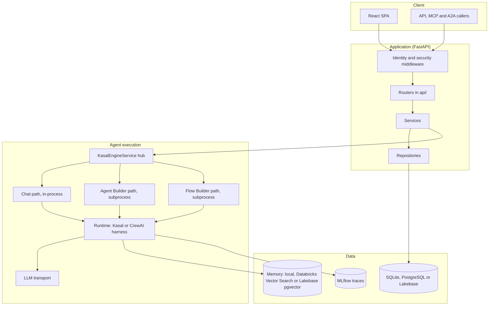

# Kasal solution architecture

This page explains the Kasal platform's layers, request lifecycles, and security model.

- [System overview](#system-overview)
- [High-level architecture](#high-level-architecture)
- [Architecture pattern](#architecture-pattern)

*Visual workflow designer for creating AI agent collaborations.*

## System overview

Kasal is an AI agent workflow orchestration platform for Databricks. The sections below cover its core design principles and the layers that make them work.

### Architecture principles

| Principle | Implementation | Where to look |
|-----------|----------------|---------------|
| Async-first | Non-blocking I/O; blocking waits run on dedicated thread pools | `services/execution/blocking_pools.py` |
| Layered | Routers call services, services call repositories | `src/backend/src/services/CLAUDE.md` |
| Fail-closed identity | A request with no identity gets 401 | `dependencies/providers.py` |
| Multi-tenant | Every row and query is scoped to a group (workspace) | `utils/user_context.py` |
| Swappable agent runtime | Kasal's own runtime by default, CrewAI as an alternative | `services/execution/harnesses/` |

## High-level architecture

A big-picture view of the client, application, agent and data layers.

## Architecture pattern

The layered approach and how requests flow through components. Paths in this section are relative to `src/backend/src/`.

### High-level

- Layered architecture: frontend (React SPA) to API (FastAPI routers) to services to repositories to the database.
- Async-first: async SQLAlchemy 2.0 sessions, background tasks and queues.
- Configuration comes from environment variables read by `config/settings.py`; models, judges and most integrations are configured in the UI. See the [configuration reference](./CONFIGURATION.md).
- Swappable agent runtime, or harness (`services/execution/harnesses/`): Kasal's own runtime by default, CrewAI as an alternative. See [Harnesses](./harnesses.md).

### Request lifecycle (CRUD path)

From HTTP request to response: validation, business logic, and persistence.

1. A router in `api/` receives the request and validates it with `schemas/`.
2. The router resolves the caller's `GroupContext` with `get_group_context` and gets an injected session (`SessionDep`).
3. The router calls a service in `services/` for business logic. The service owns the transaction scope.
4. The service reads and writes through repositories in `repositories/`. Repositories build queries; they never open or commit sessions.
5. The response is serialized with Pydantic schemas.

The rules CI enforces are in `src/backend/src/services/CLAUDE.md`: a service never builds queries or persists rows, never opens a session, and reaches another domain's data through that domain's service rather than its repository.

### Orchestration lifecycle (AI execution)

How a run is prepared, executed and observed. The `execution_type` on the request selects one of three paths.

| `execution_type` | UI name | Package | Where it runs |
|------------------|---------|---------|---------------|
| `agent` | Chat | `services/chat/` | In-process, a single agent |
| `crew` | Agent Builder | `services/agent_builder/` | Spawned subprocess (`agent_builder/process_executor.py`) |
| `flow` | Flow Builder | `services/flow_builder/` | Spawned subprocess (`flow_builder/process_executor.py`) |

- Entry: `api/executions_router.py` calls `ExecutionService` (`services/execution/service.py`).
- Hub: `KasalEngineService` (`services/execution/engine_service.py`) resolves the path and delegates. It holds no path-specific logic.
- Build: `services/execution/kernel/` is the single place both subprocess paths build agents, tasks and tools from. It calls `active_harness().build_*`, so the chosen harness supplies the agent, task and crew classes.
- Run: the Kasal runtime in `services/execution/runtime/` (agent, task, crew and the tool-call loop) or the CrewAI harness in `services/execution/harnesses/crewai/`. Either way, model calls go through the transport in `core/llm/transport/`. See the [LLM architecture](./LLM_ARCHITECTURE.md).
- Observe: the run event bus (`core/events/`) has one trace subscriber, `OTelEventBridge` (`services/otel_tracing/event_bridge.py`). Execution logs are captured by `services/execution/logs/`, traces are stored and broadcast by `services/trace/`.
- Persist: status and history go through `repositories/execution_repository.py` and `repositories/execution_history_repository.py`. Terminal outcomes are written by `services/execution/finalization.py`.
- Resume: crash-resume for crews and flows lives in `services/execution/checkpointing/`. See [Checkpointing](./CHECKPOINTING.md).

### Subprocess safety

Two small modules keep the subprocess paths from harming the server they run in:

- `services/execution/process_tree.py` terminates only the process trees this server spawned. A run's subprocess is the `multiprocessing.Process` the executor holds, and its children are found through `psutil`. When that handle is gone, the only fallback is a descendant of this server whose `KASAL_EXECUTION_ID` equals the execution ID exactly. The module never scans the whole host, so it cannot kill an unrelated `uvicorn`, `mlflow server` or test process.
- `services/execution/blocking_pools.py` gives the subprocess paths two bounded thread pools (16 threads each): one for whole-run waits and one for event-relay reads. Keeping these off the event loop's default executor stops a few long builds from starving Chat turns, and keeping the two pools apart prevents a deadlock where waits fill the pool and the relays that let a child exit cannot run.

### Background processing

Schedulers and queues for recurring and long-running tasks, started from the `lifespan` handler in `main.py`:

- Scheduled runs: `services/scheduling/scheduler.py`.
- Documentation embeddings queue: `services/knowledge/embedding_queue.py`.
- Stale and zombie execution cleanup at startup and every two minutes: `services/execution/cleanup.py`.
- Seeders run in the background after database initialization when `AUTO_SEED_DATABASE` is true.

### Data modeling

ORM entities, Pydantic schemas, and repository boundaries.

- ORM entities live in `models/`; API contracts live in `schemas/`.
- Repositories encapsulate SQL and external calls (Databricks APIs, Vector Search, MLflow).
- `db/session.py` provides the async engine and session factory, SQLite WAL mode with lock retry and backoff, and SQL echo when `SQL_DEBUG=true`.
- `db/database_router.py` routes sessions to Lakebase when it is enabled.

### Auth, identity, and tenancy

User context, group isolation, and authorization controls.

- Kasal does not authenticate users itself. A reverse proxy does, and `utils/request_identity.py` is the one place that reads the identity it forwards. Inside Databricks Apps only `X-Forwarded-Email`, `X-Forwarded-User` and `X-Forwarded-Access-Token` are trusted, and `UntrustedIdentityHeadersMiddleware` strips `X-Auth-Request-*` headers.
- `get_group_context` (`dependencies/providers.py`) turns the identity into a `GroupContext`. A request without an identity gets 401.
- For local development, `LOCAL_DEV_AUTH` (set by `run.sh`) injects a development identity through `LocalDevAuthMiddleware` in `main.py`.
- Role checks live in `core/permissions.py`; admin-only routes use `dependencies/admin_auth.py`.

For the full security model, see [Security](./SECURITY.md).

### Storage strategy

Where different data types live and why.

| Data type | Storage | Purpose |
|-----------|---------|---------|
| Transactional | SQLite (local), PostgreSQL, or Databricks Lakebase | Workflows, runs, configuration |
| Agent memory | Local store, Databricks Vector Search, or Lakebase pgvector | Semantic recall across runs |
| Traces | Execution trace table, optionally exported to MLflow | Observability |

### Observability

Logs, traces, metrics, and how to access them.

- Central log manager: `core/logger.py` writes to `LOG_DIR`.
- Logging toggles: `LOG_LEVEL` and `SQL_DEBUG`.
- Execution logs and traces are persisted and queryable through `api/execution_logs_router.py` and `api/execution_trace_router.py`.

### Configuration flags (selected)

Important toggles that affect developer and runtime experience. See the [configuration reference](./CONFIGURATION.md) for the full list.

- `DOCS_ENABLED`: enables the FastAPI `/api-docs` pages.
- `AUTO_SEED_DATABASE`: runs the seeders in the background after database initialization.
- `DATABASE_TYPE`: `sqlite` (with `SQLITE_DB_PATH`) or `postgres`.

## Related

- [Why Kasal](./WHY_KASAL.md)
- [Code structure guide](./CODE_STRUCTURE_GUIDE.md)
- [Harnesses: Kasal and CrewAI](./harnesses.md)
- [LLM architecture](./LLM_ARCHITECTURE.md)
- [Developer guide](./DEVELOPER_GUIDE.md)

Back to the [documentation hub](./README.md).
