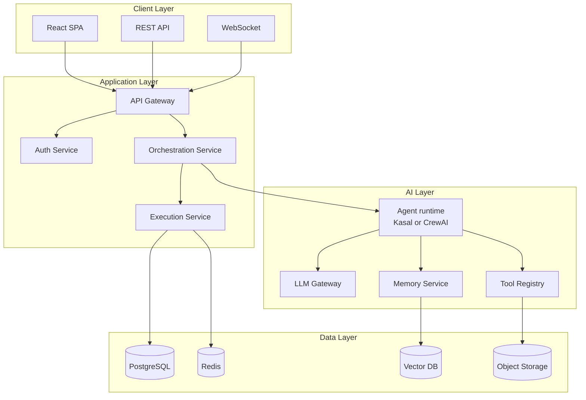

# Kasal solution architecture

This page explains the Kasal platform's layers, request lifecycles, and security model.

- [System overview](#system-overview)
- [High-level architecture](#high-level-architecture)
- [Architecture pattern](#architecture-pattern)

*Visual workflow designer for creating AI agent collaborations.*

## System overview

Kasal is an AI agent workflow orchestration platform for Databricks. The sections below cover its core design principles and the layers that make them work.

### Architecture principles

| Principle | Implementation |
|-----------|---------------|
| Async-first | Non-blocking I/O everywhere |
| Microservices-ready | Clean boundaries, API contracts |
| Zero-trust security | Every request authenticated |
| Horizontal scale | Stateless services scale out |
| Multi-tenant | Group-based data isolation |

## High-level architecture

A big-picture view of the client, application, AI, and data layers.

## Architecture pattern

The layered approach and how requests flow through components.

### High-level

- Layered architecture: Frontend (React SPA) to API (FastAPI) to Services to Repositories to Database
- Async-first (async SQLAlchemy, background tasks, queues)
- Config via environment (src/backend/src/config/settings.py)
- Swappable agent runtime, or HARNESS (src/backend/src/services/execution/harnesses/):
  Kasal's own runtime by default, CrewAI as an alternative. See [Harnesses](./harnesses.md).

### Request lifecycle (CRUD path)

From HTTP request to response: validation, business logic, and persistence.

1. Router in api/ receives request, validates using schemas/
2. Router calls services/ for business logic
3. Service uses repositories/ for DB/external I/O
4. Data persisted via db/session.py
5. Response serialized with Pydantic schemas

### Orchestration lifecycle (AI execution)

How executions are prepared, run, and observed using the engine.

- Entry via executions_router.py to execution_service.py
- Service prepares agents/tools/memory and selects engine (services/execution/harnesses/)
- Crew path:
  - Prep: services/agent_builder/crew_preparation.py and services/flow_builder/ (flow services/runners)
  - Run: services/agent_builder/process_executor.py with callbacks/guardrails
  - Observability: execution_logs_service.py, execution_trace_service.py
- Persist status/history: execution_repository.py, execution_history_repository.py

### Background processing

Schedulers and queues for recurring and long-running tasks.

- Scheduler at startup: scheduler_service.py
- Embedding queue (SQLite): embedding_queue_service.py (batches writes)
- Startup/shutdown cleanup: execution_cleanup_service.py

### Data modeling

ORM entities, Pydantic schemas, and repository boundaries.

- ORM in models/* mirrors schemas/*
- Repositories encapsulate all SQL/external calls (Databricks APIs, Vector Search, MLflow)
- db/session.py:
  - Async engine and session factory
  - SQLite lock retry with backoff
  - Optional SQL logging via SQL_DEBUG=true

### Auth, identity, and tenancy

User context, group isolation, and authorization controls.

- Databricks Apps headers parsed by utils/user_context.py
- Group-aware multi-tenant context propagated via middleware
- JWT/basic auth routes in auth_router.py, users in users_router.py
- Authorization checks in core/permissions.py

### Security controls

Defense-in-depth across the network, API, and data layers.

| Layer | Control | Implementation |
|-------|---------|----------------|
| Network | TLS | Encryption in transit |
| API | OAuth 2.0 | Databricks SSO |
| Data | Encryption at rest | Provided by the underlying store |

### Storage strategy

Where different data types live and why.

| Data type | Storage | Purpose |
|-----------|---------|---------|
| Transactional | PostgreSQL | ACID compliance |
| Vectors | Databricks Vector Search | Semantic search |
| Logs | MLflow traces | Observability |

### Observability

Logs, traces, metrics, and how to access them.

- Central log manager: core/logger.py (writes to LOG_DIR)
- API/SQL logging toggles (LOG_LEVEL, SQL_DEBUG)
- Execution logs/traces persisted and queryable via dedicated routes/services

### Configuration flags (selected)

Important toggles that affect developer and runtime experience.

- DOCS_ENABLED: enables /docs
- AUTO_SEED_DATABASE: async background seeders post DB init
- DATABASE_TYPE: sqlite with SQLITE_DB_PATH

## Related
- [Why Kasal](./WHY_KASAL.md)
- [Code structure guide](./CODE_STRUCTURE_GUIDE.md)
- [Developer guide](./DEVELOPER_GUIDE.md)
- [API endpoints reference](./api_endpoints.md)
- [Harnesses: Kasal and CrewAI](./harnesses.md)
- [CrewAI engine refactor proposal](./crewai-engine-refactor-proposal.md) (historical)

Back to the [documentation hub](./README.md).