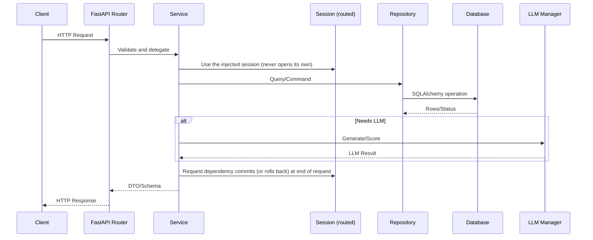
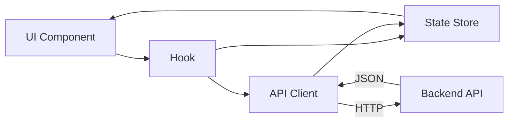

# Developer guide

Build, extend, and debug Kasal. This guide covers local setup, the backend and frontend architecture rules, and how tests and CI check your change.

- [Components you'll touch](#components-youll-touch)
- [Before you begin](#before-you-begin)
- [Run the stack locally](#run-the-stack-locally)
- [Authentication in local development](#authentication-in-local-development)
- [Choose a database](#choose-a-database)
- [Developer architecture overview](#developer-architecture-overview)
- [Backend architecture](#backend-architecture)
- [Frontend architecture](#frontend-architecture)
- [End-to-end flow](#end-to-end-flow)
- [Test and lint your change](#test-and-lint-your-change)

## Components you'll touch
- **Frontend (React SPA)**: UI, designer, monitoring
- **API (FastAPI)**: REST endpoints and validation
- **Services**: Orchestration and business logic
- **Repositories**: DB and external I/O (Databricks, Vector, MLflow)
- **Execution**: Kasal's own agent runtime (`services/execution/`) behind three paths: Chat, Agent Builder and Flow Builder
- **Data & Storage**: SQLAlchemy models/sessions, embeddings, volumes

## Before you begin
Tools and versions you need before running the stack.
- Python 3.11 (the backend pins `>=3.11,<3.12`) and [uv](https://docs.astral.sh/uv/). Dependencies are declared in `src/backend/pyproject.toml` and pinned in `src/backend/uv.lock`; there is no `requirements.txt`.
- Node.js 22 (what CI uses) and npm.
- SQLite needs nothing extra and is what `run.sh` uses by default. PostgreSQL is optional locally.
- Databricks access if you exercise Databricks features.

## Run the stack locally

Install the backend dependencies and start the server from `src/backend`:

```bash
cd src/backend
uv sync            # creates src/backend/.venv from uv.lock
./run.sh           # SQLite; ./run.sh postgres for PostgreSQL
```

To change a dependency, edit `src/backend/pyproject.toml`, run `uv lock`, then `uv sync`. Never edit `uv.lock` by hand.

`run.sh` does the following, in order:

1. Stops Kasal processes left over from a previous run of this checkout: the `uvicorn` reload parent, orphaned crew and flow subprocesses, and their `multiprocessing` resource trackers. It only touches processes whose working directory is inside `src/backend`.
2. Checks the port (`KASAL_PORT`, default `8000`). If something else still holds it, `run.sh` prints the owning PID and command and refuses to start, unless `KASAL_KILL_PORT_OWNER=true`, in which case it sends that process SIGTERM.
3. Runs `uv sync --frozen`. If the sync fails, it prints the error and continues with the existing `.venv`, or exits if there is none.
4. Exports `LOCAL_DEV_AUTH=true` (unless you set it), then starts `.venv/bin/uvicorn src.main:app --reload --reload-dir src` on `KASAL_BIND_HOST` (default `127.0.0.1`).

Binding to anything other than loopback prints a warning, because with `LOCAL_DEV_AUTH` on, anyone who can reach the port acts as the development user. Run `./run.sh -h` for the logging flags (`-q`, `-v`, `-d`, `--no-console`, `--no-file`) and the `KASAL_LOG_*` variables.

Start the frontend in a second terminal:

```bash
cd src/frontend
npm ci
npm start          # Vite dev server on http://localhost:3000
```

In development the frontend calls `http://localhost:8000/api/v1` directly (`src/frontend/src/shared/api/client.ts`), and the Vite proxy also targets port 8000. If you move the backend with `KASAL_PORT`, start the frontend with `VITE_API_URL=http://localhost:<port>/api/v1`.

Interactive API docs are served at `/api-docs` on the backend. For every environment variable, see the [configuration reference](./CONFIGURATION.md).

## Authentication in local development

Every API call needs an identity. Inside Databricks Apps it comes from the platform proxy, through the `X-Forwarded-Email`, `X-Forwarded-User` and `X-Forwarded-Access-Token` headers. A request with no identity gets **401**; the backend no longer assumes a default user.

Locally there is no proxy, so Kasal offers an opt-in development identity:

- `LOCAL_DEV_AUTH=true` makes `LocalDevAuthMiddleware` (`src/backend/src/main.py`) add `X-Forwarded-Email: <LOCAL_DEV_USER_EMAIL>` to any request that has no identity header.
- `LOCAL_DEV_USER_EMAIL` sets that user. The default is `dev@localhost`.
- `run.sh` sets `LOCAL_DEV_AUTH=true` for you. If you start `uvicorn` or `src/entrypoint.py` yourself, export it first, or every API call returns 401.
- It is refused in production: when `DATABRICKS_APP_NAME` is set or `ENVIRONMENT` is `production`, the flag is ignored and an error is logged. `python src/entrypoint.py --environment dev` sets `DATABRICKS_APP_NAME`, so it switches the development identity off too.

`LOCAL_DEV_AUTH` is read with `os.getenv`, so putting it in a `.env` file has no effect. Export it in your shell.

To start the backend without `run.sh`:

```bash
cd src/backend
export DATABASE_TYPE=sqlite LOCAL_DEV_AUTH=true
.venv/bin/uvicorn src.main:app --host 127.0.0.1 --port 8000
```

For the full auth model, see the [security reference](./SECURITY.md) and the [API endpoints reference](./api_endpoints.md).

## Choose a database

The default database depends on how you start the backend:

| Entry point | Default database | SQLite file |
|---|---|---|
| `./run.sh` | SQLite | `./app.db`, relative to where you run it; run it from `src/backend` |
| `uvicorn`, `alembic`, `python run_seeders.py` (through `Settings`) | PostgreSQL (`DATABASE_TYPE` defaults to `postgres`) | `src/backend/app.db` when `DATABASE_TYPE=sqlite` |
| `python src/entrypoint.py` | SQLite (`--db-type sqlite`) | `src/kasal.db` |

So if you use `run.sh` with SQLite, prefix the other commands with `DATABASE_TYPE=sqlite`, or they target a PostgreSQL server on `localhost:5432`:

```bash
cd src/backend
DATABASE_TYPE=sqlite uv run alembic upgrade head
DATABASE_TYPE=sqlite uv run python run_seeders.py
```

Alembic does not run at startup. The app builds its schema with `init_db()` (`create_all` plus the self-heal steps in `src/backend/src/db/self_heal/`), so a column added to an existing table needs a self-heal step as well as a migration. Seeders run in the background at startup while `AUTO_SEED_DATABASE` is on.

## Developer architecture overview

This section gives developers a high-level view of the front end and back end. It explains core components and shows how to understand and trace them.

## Backend architecture

The backend uses FastAPI with a clean layered structure. It separates HTTP routing, business services, repositories, and SQLAlchemy models.

### Core components

- API routers: `src/backend/src/api/` map HTTP endpoints to service calls.
- Services: `src/backend/src/services/<domain>/` implement business logic and hold the transaction. Every service lives in a domain package.
- Repositories: `src/backend/src/repositories/` own every query and every row write.
- Models and schemas: `src/backend/src/models/` and `src/backend/src/schemas/` define persistence and I/O contracts.
- Execution: `src/backend/src/services/execution/` holds the agent runtime (`runtime/`), the harnesses (`harnesses/`) and the shared kernel, behind the Chat (`services/chat/`), Agent Builder (`services/agent_builder/`) and Flow Builder (`services/flow_builder/`) paths. LLM calls go through `src/backend/src/core/llm/`.
- Database and sessions: `src/backend/src/db/` configures sessions, the database router and the schema self-heal; migrations live in `src/backend/migrations/`.
- Config and security: `src/backend/src/config/` and `src/backend/src/dependencies/` provide settings, identity and group context.

### Typical request flow

A request passes through router, service, repository, and database. LLM calls route through the LLM manager when needed.



### How to understand backend components

- Start at the router file for the endpoint path.
- Open the service it calls and read business logic.
- Inspect repository methods and referenced models.
- Check schema types for request and response contracts.
- Review unit tests under `src/backend/tests` for examples.

### Example: minimal endpoint wiring

This shows the router, service and repository wiring the backend uses (modelled
on `api/agents_router.py` and `services/CLAUDE.md`). The session is created once
per request by the `SessionDep` dependency and flows **down**: router, then
service, then repository. Nothing below the router acquires a session of its own.

```python
# api/items_router.py
async def get_item_service(session: SessionDep) -> ItemService:
    return ItemService(session=session)

ItemServiceDep = Annotated[ItemService, Depends(get_item_service)]

@router.get("/{item_id}", response_model=ItemOut)
async def get_item(item_id: UUID, service: ItemServiceDep, group_context: GroupContextDep):
    item = await service.get_item(item_id, group_context)
    if item is None:
        raise HTTPException(status_code=404, detail="Item not found")
    return item

# services/items/item_service.py  (every service lives in a domain package)
class ItemService:
    def __init__(self, session: AsyncSession,
                 repository_class: Type[ItemRepository] = ItemRepository):
        self.session = session
        self.repository = repository_class(session)  # built on the GIVEN session

    async def get_item(self, item_id: UUID, group_context: GroupContext) -> ItemOut | None:
        item = await self.repository.get_for_group(item_id, group_context.group_ids)
        return ItemOut.model_validate(item) if item else None

# repositories/item_repository.py
class ItemRepository(BaseRepository[Item]):
    def __init__(self, session: AsyncSession):
        super().__init__(Item, session)  # receives a session, never opens one

    async def get_for_group(self, item_id: UUID, group_ids: list[str]) -> Item | None:
        result = await self.session.execute(
            select(Item).where(Item.id == item_id, Item.group_id.in_(group_ids))
        )
        return result.scalar_one_or_none()
```

The rules CI enforces (details in `src/backend/src/services/CLAUDE.md`):

- **Layers only import downward.** `api` → `services` → `repositories` → `models`, with `core`, `utils` and `schemas` below everything. `import-linter` checks this, including transitive chains; the contracts are `[tool.importlinter]` in `src/backend/pyproject.toml`.
- **Every service is a package.** A new service goes in `services/<domain>/<module>.py`, never a loose `services/<name>_service.py`.
- **A service never builds queries or persists rows.** `select(...)`,
  `session.execute` and `session.add/delete/merge` belong in a repository; a
  service holds the session only for transaction control.
- **A service never opens a session or builds an engine.** Use the injected
  session inside a request, or `routed_scoped_session()` outside one.
- **Another domain's data goes through that domain's service**, not its
  repository, so the owning domain's rules (group scoping, encryption, status
  transitions) still apply.
- **There is no Unit of Work.** `src.core.unit_of_work` has been deleted; the
  session already is the unit of work. Treat any example using `self.uow` or
  `UnitOfWork` as stale.

The AST checks for the last four rules live in `src/backend/tests/unit/architecture/`.

## Frontend architecture

The frontend is a React + TypeScript application. It organizes UI components, API clients, state stores, hooks, and utilities.

### Core components

- App shell: `src/frontend/src/app/` holds routes, startup and cross-feature composition.
- Features: `src/frontend/src/features/<domain>/` hold a domain's views, feature-local state, hooks and API calls (for example `features/chat/`, `features/workflow/`, `features/executions/`).
- Shared: `src/frontend/src/shared/` holds the HTTP client (`shared/api/client.ts`), presentation helpers and the A2UI renderer.
- API clients: `src/frontend/src/api/` wrap domain endpoints with typed static methods over `apiClient`.
- Stores: `src/frontend/src/store/` holds the shared Zustand stores. Zustand is the only state library.
- Types and config: `src/frontend/src/types/` and `src/frontend/src/config/` provide contracts, defaults and i18n.

### UI data flow

Components call hooks, which use stores and API clients. Responses update state and re-render the UI.



### How to understand frontend components

- Locate the component rendering the feature.
- Check its hook usage and props.
- Open the API client method it calls.
- Review the store slice it reads or writes.
- Inspect related types in src/frontend/src/types.

### Example: calling an API from a component

A component loads items through an API service built on `apiClient`, which sets the base URL (`/api/v1` in production) and reports failures. Don't call `fetch` with hand-built auth headers: in Databricks Apps the platform proxy supplies the identity.

```ts
// api/items/ItemService.ts
import { apiClient } from '../../shared/api/client';

export class ItemService {
  static async getItem(id: string): Promise<Item> {
    const response = await apiClient.get<Item>(`/items/${id}`);
    return response.data;
  }
}

// features/items/components/ItemView.tsx
const ItemView: React.FC<{ id: string }> = ({ id }) => {
  const [item, setItem] = useState<Item | null>(null);
  useEffect(() => { ItemService.getItem(id).then(setItem); }, [id]);
  return item ? <div>{item.name}</div> : <span>Loading...</span>;
};
```

## End-to-end flow

This ties front end and back end with shared contracts. It helps new developers trace a feature quickly.

- The request path runs: Frontend Component, Hook, Store/API Client, Backend Router, Service, Repository, DB.
- Shared types and response shapes live in frontend types and backend schemas.
- Tests show usage patterns: `src/backend/tests/unit/` mirrors `src/backend/src/`, and frontend tests sit next to the code as `*.test.ts(x)`.

## Test and lint your change

Run the backend checks from `src/backend`:

```bash
uv run python run_tests.py              # tests, then black, isort, ruff, the mypy baseline and import-linter
uv run python run_tests.py --skip-lint  # tests only
uv run python run_tests.py --lint-only  # static checks only
uv run python run_tests.py --type unit --coverage
```

`run_tests.py` runs pytest in parallel by default (`--parallel auto`); pass `--parallel 0` to step through a test. The mypy step fails only on errors that are not in `mypy-baseline.json`.

Run the frontend checks from `src/frontend`. The frontend uses Vitest with React Testing Library; there is no Jest and no Cypress or Playwright suite:

```bash
npm run test:run   # Vitest, single run (what CI runs); npm test for watch mode
npm run lint
npm run build      # tsc -b, then vite build
```

CI runs the same commands. For what gates a pull request and what is report-only, see [continuous integration](./continuous-integration.md).

---

## Related
- [Code structure guide](./CODE_STRUCTURE_GUIDE.md)
- [Architecture guide](./ARCHITECTURE_GUIDE.md)
- [Configuration reference](./CONFIGURATION.md)
- [Continuous integration](./continuous-integration.md)
- [Harnesses](./harnesses.md)

Back to the [documentation hub](./README.md).
